# List Context Anidado

# Tabla de Contenidos
1. [Descripción](#Descripción)
2. [Data Entities](#Data-Entities)
3. [Master Data](#Master-Data)
4. [Site Editor](Site-Editor)
5. [Admin](#Admin)
6. [Store Theme](#Store-Theme)

## Descripción

> La carpeta **itgloberspartnercl-list_contex-anidado** contiene un componente custom el cual cumple varias funciones. La primera, dar al usuario final la opción de visualizar los departamentos, inicialmente de Colombia, y al seleccionar un departamento podrá ver sus respectivos municipios.

<div >
<p style = 'text-align:center;'>

<p/>
<div/>

<div >
<p style = 'text-align:center;'>
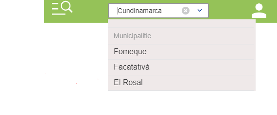
<p/>
<div/>

# Configuración del componente

## Data Entities

> En DATA ENTITIES se deben crear dos estructuras de datos, una para Departamentos y una para Municipios.

### Departamentos

Debe ser creado con los siguientes campos requeridos:
- Acronym **DD**
- Name **DaneDepartment**

- 3 filas <br>
**code_dane** = varchar 50 <br/>
**label** = varchar 50  <br/>
**slug** = varchar 50 <br/>

 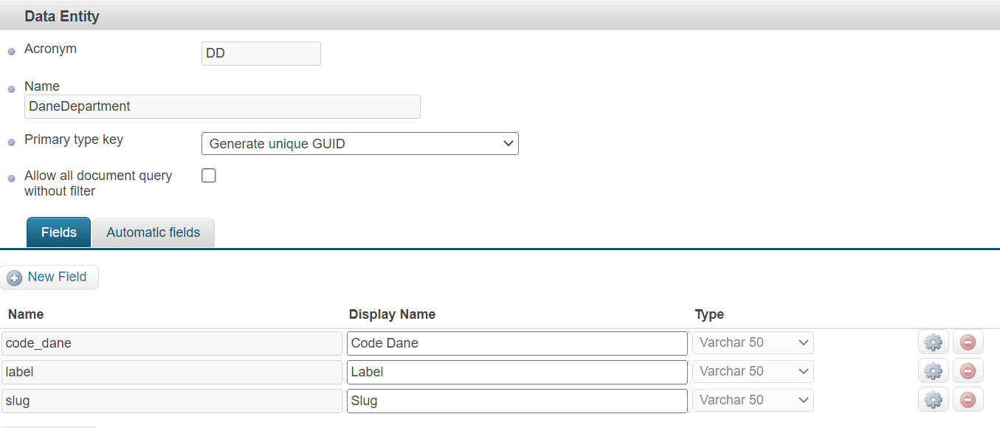
<br/>
  
### Municipios

Debe ser creado con los siguientes campos requeridos:
- Acronym **MD**
- Name **DaneMunicipality**

- 5 filas <br>
**label** =	varchar 50  <br>
**slug** =	varchar 50 <br>
**code_dane** =  varchar 50 <br>
**code_dane2** =  varchar 50 <br>
**code_department** =  varchar 50 <br>

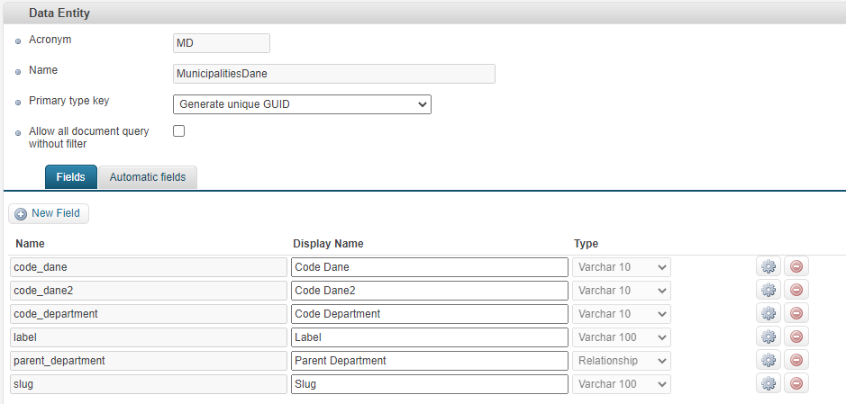
  
# **Al crear las entidades se deben públicar y reindexar**
  <br/>
  
## Master Data

> En master data se crea una aplicación, a esta se le  crean sus respectivos  formularios y se seleccionan las entidades de datos creadas anteriormente, seleccionando los campos que se deseen mostrar.

<div >
<p style = 'text-align:center;'>
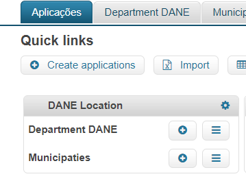
<p/>
<div/>

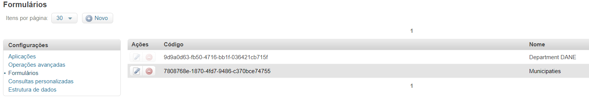
  

> Al crear un nuevo dato ya sea **Departamento** o **Municipio** desde **MASTER DATA** se debe tener en cuenta que el **SLUG** es el mismo nombre del Departamento o Municipio, pero **todo en minúsculas, reemplazando los espacios por guión bajo y quitando cualquier carácter especial**

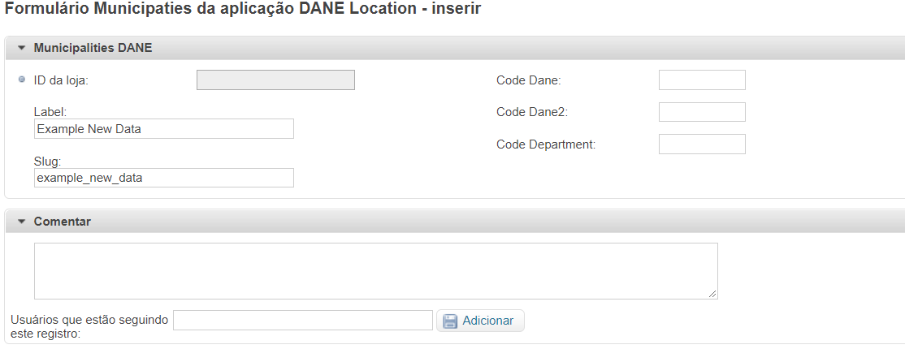
  
  <br/>  

## Site Editor

>Desde el site-editor se puede dar una completa configuración, ya que cuenta con la opción de asignar el título referente a la promoción, el valor en porcentaje del descuento, la categoría en la cual se asignará el descuento, el enlace para redirigir al usuario a una página de la categoría, y seleccionar una  demostrativa a la promoción.


  <br/>

## Admin

> Desde el vtex admin para una persona administradora de la tienda, podrá visualizar todos los departamentos, con su respectivo nombre, slug (que es tratado como un enlace) y código DANE además con las opciones de:

- Crear Departamento
- Ver Detalles
- Editar
- Eliminar


    <br/>

 > Al ingresar a los detalles del departamento, visualizará el nombre, slug y código DANE, además un listado de los municipios correspondientes a este departamento. También con las opciones de **Crear**. **Editar** y **Eliminar** municipio. Estos municipios muestran la siguiente información:

- Nombre
- Slug
- Código DANE principal
- Código DANE secundario (municipio cercano)
- Código DANE departamento


  <br/>

## Crear Departamento
 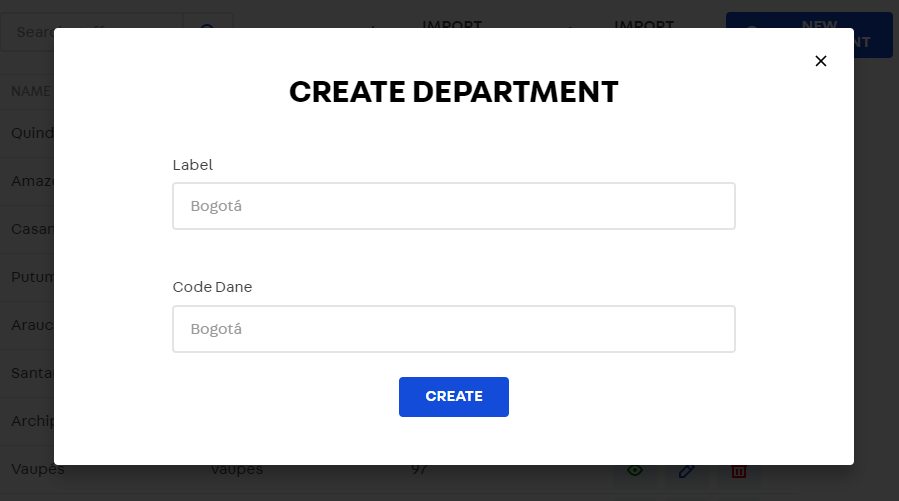

  <br/>

## Crear Municipio
 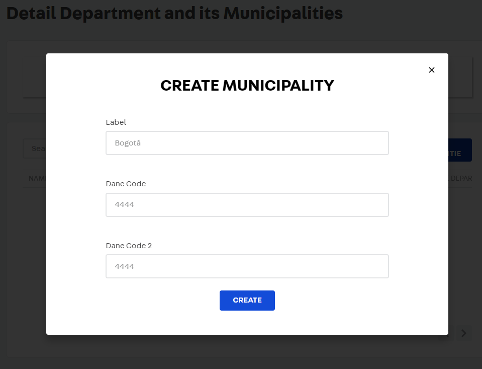

  <br/>

## Actualizar Departamento

 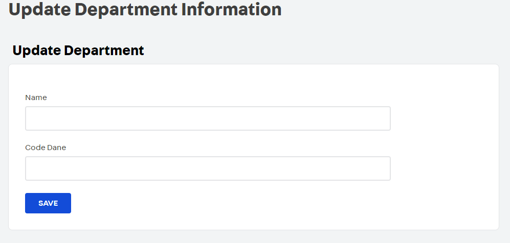

  <br/>

## Actualizar Municipio

 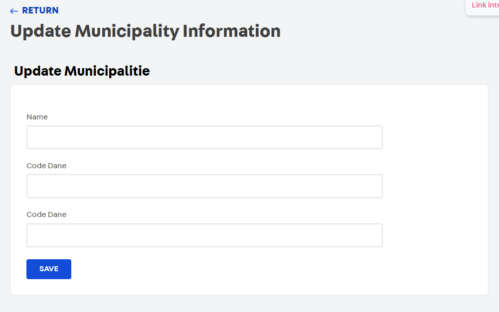

  <br/>

## Eliminar Departamento o Municipio

 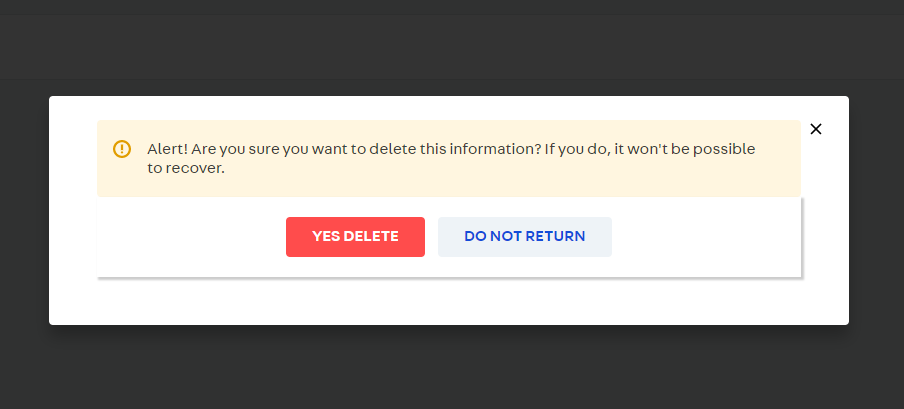

  <br/> 

 ## Cargas masivas
 
 En caso de necesitar cargar múltiples registros a la entidad de datos se pueden utilizar los botones `IMPORT DEPARTMENTS` e `IMPORT MUNICIPALITIES`
 
 


Para generar una carga masiva se necesita un documento con extensión `.csv` separado estríctamente por comas. Para que la carga de municipios sea existosa se necesita que los nombres de las columnas sean 'code_dane', 'label', 'code_department', ' code_dane2'. Se permiten variaciones de estos nombres como:
Code Dane, LABEL, code    department    2 entre otros pero los nombres deben ser iguales a los mostrados anteriormente de lo contrario se mostrará una alerta y no se permitirá la carga masiva.

Para el caso de los departamentos, solo se necesitan las columnas 'code_dane'(en este caso el codigo dane del departamento) y 'label' (nombre del departamento).
 
 <br/>
 
### Mensajes de carga masiva

Error al nombrar comlumnas:


Carga exitosa, pero hubieron registros ya existentes que no fueron cargados:


Carga exitosa:


 <br/>

### Departamentos.csv


### Municipios.csv


 <br/>


La carga primero valida y elimina filas cuyos codigos dane ya se encuentren en la base de datos. Al completarse la carga masiva se mostrará una alerta con los códigos que no fueron incluídos.
NOTA: A veces las cargas masivas se demoran en aparecer en la base de datos, por lo tanto si los cambios no se reflejan de inmediato es recomendado no volver a subir el mismo archivo de inmediato.

 <br/>
  
### Exportación de archivos 


 
 Los botones `EXPORT MUNICIPALITIES` y `EXPORT DEPARTMENTS` exportan los registros existentes a un archivo .xlsx
 <br/>
 
## Store Theme  
  
### Configurar archivo **manifest.json**

> En el archivo manifest se debe configurar el vendor en el cual va a usar el componente, si desea cambiar el título y la descripción del componente. 

 <br/> 
  
##### Ejemplo

``` json
  {
  “vendor”: ”itgloberspartnercl”,
  “title”: "Nested list context",
  "description": "List context que recibe rmación de departamentos con sus respectivos municipios"
  }
```
   <br/> 
### Configurar archivo **navigation.json**
> El componente esta desarrollado para que renderice en la sección administrativa de Orders si desea cambiarlo, debe ingresar a la carpeta admin global, archivo navigation.json y en el apartado de section  cambiarlo.

 <br/>
  
##### Ejemplo
``` json
  {
    "section": "orders",
  }
```

> Habiendo hecho las configuraciones anteriores, se puede hacer link del componente a la tienda y hacer uso de él

## Store Theme 

> Para hacer uso del componente en el store theme, se víncula el componente en el archivo manifest.json de la tienda.

##### Ejemplo
``` jsonc
  {
    "itgloberspartnercl.nested-list-context": "0.x"
  }
```
> Desde el componente que se vaya a hacer uso basta con linkearlo (preferiblemente en el Header) 

##### Ejemplo
``` jsonc
  {
    "nested-list-context"
  }
```

<br/>

### Clonar el repositorio

> Desde el siguiente enlace podrás clonar el repositorio y poder trabajar en él desde la computadora local 
## [clonar repositorio](https://github.com/CarlosGiovannyG/list_contex-anidado "clonar repositorio") 

## Contributors ✨

Thanks goes to these wonderful people ([emoji key](https://allcontributors.org/docs/en/emoji-key)):

<!-- ALL-CONTRIBUTORS-LIST:START - Do not remove or modify this section -->
<!-- prettier-ignore-start -->
<!-- markdownlint-disable -->
<table>
  <tr>
  <td 
    align="center">
    <a 
    href="https://github.com/CarlosGiovannyG">
    <br />
    <sub>
    <b>Carlos Giovanny Gualtero</b>
    </sub></a><br />
    <a 
    href="https://github.com/CarlosGiovannyG/list_contex-anidado" 
    title="Documentation"
    >📖</a></td>
    <td 
    align="center">
    <a 
    href="https://github.com/Marlon1101">
    <br />
    <sub>
    <b>Marlon De La Roche</b>
    </sub></a><br />
    <a 
   href="https://github.com/CarlosGiovannyG/list_contex-anidado" 
    title="Documentation"
    >📖</a></td>
   <td 
    align="center">
    <a 
    href="https://github.com/krackram20">
    <br />
    <sub>
    <b>Kevin Ramírez</b>
    </sub></a><br />
    <a 
    href="https://github.com/CarlosGiovannyG/list_contex-anidado" 
    title="Documentation"
    >📖</a></td>
  </tr>
</table>

<!-- markdownlint-enable -->
<!-- prettier-ignore-end -->

<!-- ALL-CONTRIBUTORS-LIST:END -->

This project follows the [all-contributors](https://github.com/all-contributors/all-contributors) specification. Contributions of any kind are welcome!

<!-- DOCS-IGNORE:end -->
